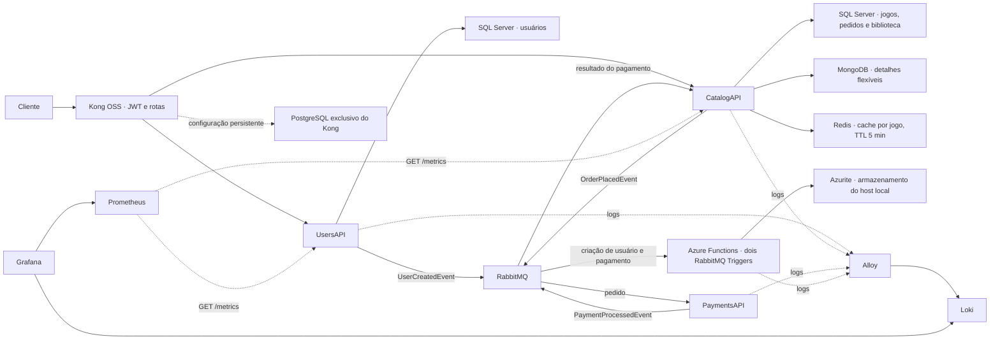

# Arquitetura — FIAP Cloud Games, Fase 3

## Visão geral

A solução separa identidade, catálogo e pagamentos em microsserviços .NET 10. O Kong OSS é a entrada HTTP das APIs de negócio; eventos RabbitMQ acionam pagamentos e notificações. Cada tecnologia de persistência tem uma responsabilidade distinta.

## Gateway e segurança

Kong 3.9.3 usa modo tradicional e PostgreSQL próprio. Esse banco armazena configuração administrativa, não dados de jogos ou usuários. O script PowerShell `kong/configure-kong.ps1` reconcilia dois Services, cinco Routes, um Consumer, a credencial HS256 e os plugins pela Admin API.

| Entrada | Destino interno | Política |
| --- | --- | --- |
| POST /identity/users | UsersAPI /api/users | Pública, caminho exato |
| POST /identity/auth/login | UsersAPI /api/auth/login | Pública, caminho exato |
| POST /identity/auth/forgot-password | UsersAPI /api/auth/forgot-password | Pública, caminho exato |
| /identity e subcaminhos | UsersAPI /api | JWT, todos os verbos |
| /catalog e subcaminhos | CatalogAPI /api | JWT, todos os verbos |

As exceções públicas têm regex de maior prioridade e reescrita explícita de URI. Os fallbacks removem o prefixo da API e acrescentam `/api` pelo Service. Novos POSTs não se tornam públicos automaticamente.

O Kong verifica assinatura e expiração e identifica o emissor pela claim `iss`. As APIs também validam JWT, incluindo audiência, identidade e autorização por perfil. Um token válido de usuário comum não permite administrar usuários, jogos ou detalhes Mongo.

No Docker, Admin API e Manager são publicados somente em loopback. No Kubernetes, Admin API é ClusterIP e Manager está desativado. UsersAPI e CatalogAPI não oferecem portas externas diretas na base integrada. ClusterIP, por si só, não substitui políticas de rede.

## Persistência e cache

SQL Server mantém o domínio relacional: identidade, jogos, pedidos e biblioteca. MongoDB mantém atributos opcionais por `Game.Id`, com `_id` UUID padrão, `schemaVersion`, conteúdo e datas UTC. O driver oficial MongoDB .NET realiza as operações. PUT substitui os detalhes e preserva a data de criação; a ausência de documento não impede consultar ou comprar jogos existentes.

Cada SQL Server usa `MSSQL_MEMORY_LIMIT_MB=2048` abaixo do teto do container (3 GB/GiB), preservando margem conforme as [orientações oficiais de memória](https://learn.microsoft.com/en-us/sql/linux/configure/performance-best-practices-sql-server-memory?view=sql-server-ver17). Deployments dos bancos usam Recreate e mantêm os PVCs existentes durante atualizações.

GET individual compõe SQL e Mongo e aplica cache-aside com `IDistributedCache` e o provider StackExchange.Redis. O hash `fcg:catalog:games:v1:{gameId}` guarda a resposta compartilhada do jogo, sem identidade ou token. Leituras não renovam o TTL absoluto de cinco minutos. Atualização SQL, desativação e alteração dos detalhes invalidam a chave depois da persistência.

Redis indisponível permite consulta direta. Mongo indisponível em uma leitura não cacheada permite retornar os dados SQL com `detailsStatus=unavailable`; uma gravação Mongo retorna 503, não sucesso fictício. Compras calculam preço e disponibilidade no SQL, sem confiar no cache.

## Mensageria e Function

| Evento | Publicador | Fila / consumidor |
| --- | --- | --- |
| UserCreatedEvent | UsersAPI | notifications-user-created-event / UserCreatedFunction |
| OrderPlacedEvent | CatalogAPI | payments-order-placed-event / PaymentsAPI |
| PaymentProcessedEvent | PaymentsAPI | catalog-payment-processed-event / CatalogAPI |
| PaymentProcessedEvent | PaymentsAPI | notifications-payment-processed-event / PaymentProcessedFunction |

As filas de catálogo e notificação recebem cópias independentes do pagamento. A confirmação é assíncrona: a compra retorna 202 com `orderId`, o pagamento simulado aprova ou rejeita o pedido e a CatalogAPI atualiza a biblioteca quando aprovado. A Function preserva os contratos e lê o envelope MassTransit, registrando `MessageId`, usuário e pedido nos logs.

O código, Dockerfile, Compose independente, configuração RabbitMQ e infraestrutura Kubernetes da Function ficam em seu próprio repositório. A orquestração referencia esses arquivos diretamente. NotificationsAPI permanece apenas como alternativa legada; não consome simultaneamente as mesmas filas.

O runtime oficial Azure Functions v4 e o worker isolado .NET 10 executam localmente, com Azurite e RabbitMQ. Não há recursos Azure, Application Insights, KEDA ou cobranças de nuvem. O host local permanece ativo para aguardar eventos: esta demonstração não comprova scale-to-zero ou autoscaling. A mudança demonstra funções orientadas a eventos e execução por invocação em vez de um consumer MassTransit implementado no worker contínuo. Em um serviço gerenciado, o provedor pode administrar capacidade e ciclo de vida conforme o plano utilizado.

## Observabilidade

A implementação escolhe a **Opção A: Prometheus e Grafana**. UsersAPI e CatalogAPI expõem métricas HTTP e de processo por `prometheus-net.AspNetCore`; Prometheus realiza scrape interno a cada 15 segundos. O dashboard `fcg-apis` apresenta disponibilidade da coleta, total de requisições, contagem por status HTTP, respostas por segundo, taxa de erros 5xx, latência p95 e memória.

Health checks e scrapes não contam como tráfego de negócio. Requisições bloqueadas no Kong não chegam às métricas das APIs. Contadores representam o processo desde sua inicialização; p95 é estimado pelo histograma e exige amostras. Não há tracing distribuído ou alertas nesta opção.

Alloy centraliza logs de quatro aplicações no Loki; Grafana consulta a fonte `fcg-loki` e o dashboard `fcg-logs`. No Docker, a coleta utiliza um proxy restrito da API Docker, sem escrita. No Kubernetes, utiliza ServiceAccount e RBAC somente para pods e seus logs no namespace da aplicação, sem acesso a Secrets ou arquivos dos nós. Loki persiste os logs coletados com retenção de 72 horas. Os históricos Docker e Kubernetes são independentes.

## Limites do ambiente acadêmico

- Pagamentos e envio de e-mails são simulados.
- Credenciais versionadas são exclusivamente locais; produção exige proteção, rotação e controle de acesso.
- Não existe transação distribuída entre SQL, Mongo, Redis e RabbitMQ. Falha entre salvar e publicar pode perder um evento; não há outbox.
- Invalidação do cache é eventualmente consistente e limitada pelo TTL; não há locks distribuídos.
- O binding RabbitMQ da Function não herda automaticamente retries, `_error` ou `Fault<T>` do MassTransit. Não existe deduplicação persistente ou política completa de DLQ.
- Targets estáticos Prometheus pressupõem uma réplica por API. Escala horizontal exige descoberta por endpoint/pod.
- Volume persistente não equivale a backup; a retenção Loki não impõe cota de disco.
- Os manifestos destinam-se ao ambiente local, não constituem uma configuração endurecida de produção.
